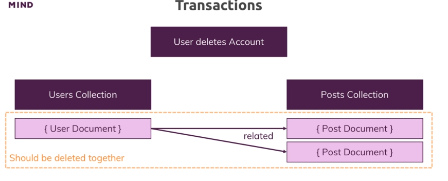

# Transactions

Will delete user so we also have to delete all posts of that user.

```
            User deletes Accounts
Users Collection              Posts Collection
--------------------------------------------------------
|   { User Document } -----------> { Post Document }   |
|                     \                                |
|             related  \                               | 
|                       \--------> { Post Document }   |
|  Should be deleted together                          |
---------------------------------------------------------
```



Always have to change IP address into MongoDB cloud cluster. First have access to the MongoDB cloud
mongo "mongodb+srv://mytestingcluster.n7v1t.mongodb.net/<test1>" --username jahid

```cpp
> use blog
> db.users.insertOne({name: 'Max'})
> db.posts.insertMany([{title: 'A js post', views: 23, userId: ObjectId("5f4163d6526c4846e4c6fe1b")}, {title: 'Group discussion', views: 2, userId: ObjectId("5f4163d6526c4846e4c6fe1b")}])
```

Have to execute the mongo session to work with the Transactions

```cpp
const session = db.getMongo().startSession()
session.startTransaction()
```

```cpp
const usersCol = session.getDatabase('blog').users
const postsCol = session.getDatabase('blog').posts
```

This is basically will remove/delete the user 

```cpp
usersCol.deleteOne({_id: ObjectId("5f4163d6526c4846e4c6fe1b")})
```

This command also successfully executes (this comes from the cloud, not the session), but we deleted the user before

```bash
> postsCol.deleteMany({userId: ObjectId("5f4163d6526c4846e4c6fe1b")})
> usersCol.deleteOne({_id: ObjectId("5f4163d6526c4846e4c6fe1b")})
{ "acknowledged" : true, "deletedCount" : 1 }
```

It was basically deleted from the cache but not from the real server as we do not start the transactions. MongoDB just keeps tracking(or acknowledging) what has to do in this transection.

```bash
db.users.find().pretty()
{ "_id" : ObjectId("5f4163d6526c4846e4c6fe1b"), "name" : "Max" }
```

To execute fully delete from the cloud have to commit to the Transactions

```bash
session.commitTransaction()
```

Now deleted from the cloud

```cpp
db.users.find().pretty()
```

Can also abort --> all things are trying to delete fully

So these actions either succeed together or all fail together. That is the idea behind the transactions.

This basically comes from atomicity
Get atomicity in the operation level not just on a document level
So need cross-operation consistency